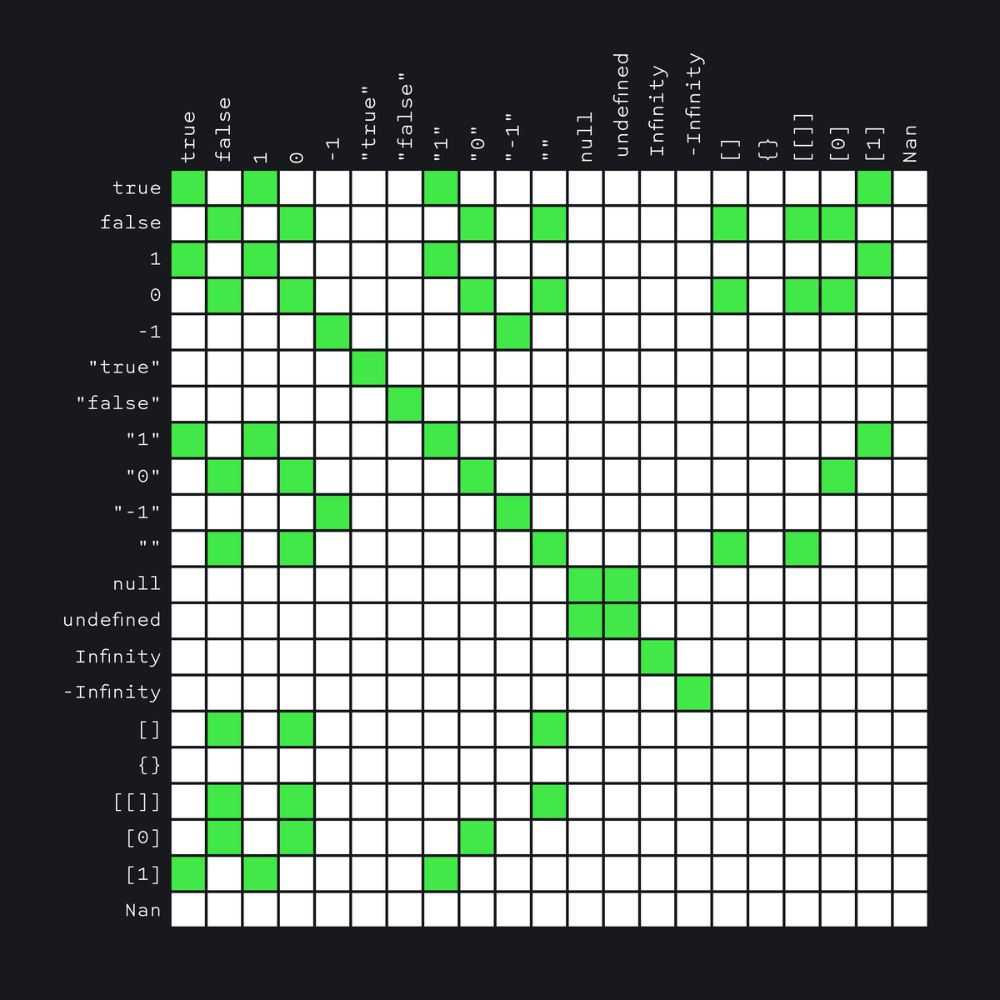
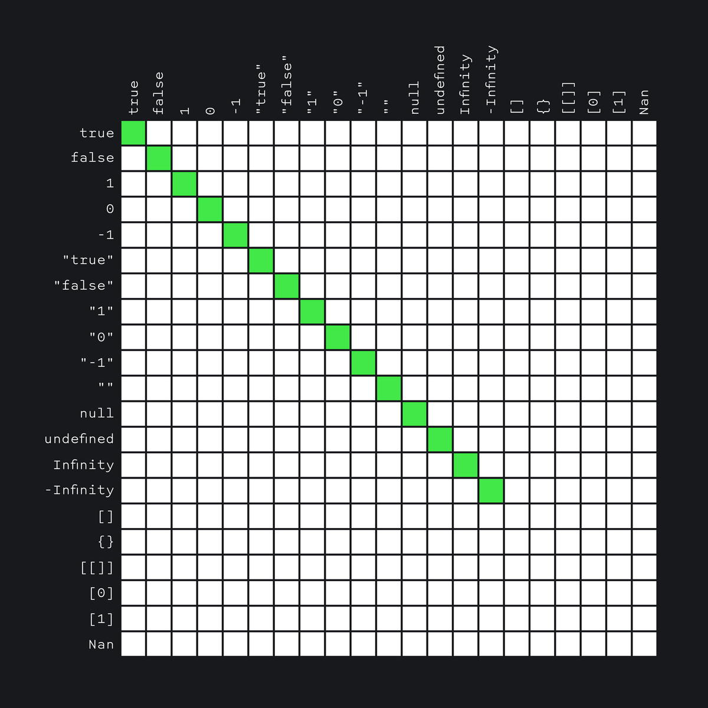

# Type Conversion

### Installation and use
> You can install the script by cloning/downloading this repository and running Live Server in VS Code. It is also possible to pull the image from the docker hub [ _docker pull alekstar79/type-conversion_ ] and run [ _docker run -d -p 80:80 --rm --name type-conversion alekstar79/type-conversion_ ]. For ease of use, a Makefile has been created with short commands [ _pull, run, stop_ ].


## Brief

Type casting (conversion) is the process of converting a value from one type to another.
In JavaScript, types can be converted both explicitly and implicitly.
When we call a function to get a concrete type, this is an explicit conversion:

```js
const x = '4'
Number(x)

const y = 4
String(y)
```

Comparison is either _strict_ or _non-strict_. With a _strict_ comparison (`===`), the interpreter takes into account the types of the values being compared.

When we compare values _non-strictly_ with each other using `==`, JavaScript casts the types on its own:

```js
console.log(5 == '5')  // true
console.log(5 === '5') // false
```

To understand why this is the case, you first need to understand what types are in JS.
First, let's make a distinction between primitive types, objects, and others.

## Primitive types

JavaScript has the following primitive types:

```js
// 1. Undefined
typeof undefined === 'undefined'

// 2. Boolean
typeof true === 'boolean'
typeof false === 'boolean'

// 3. Number
typeof 42 === 'number'
typeof 4.2 === 'number'
typeof -42 === 'number'
typeof Infinity === 'number'
typeof -Infinity === 'number'

// 4. String
typeof '' === 'string'
typeof 'string' === 'string'
typeof 'number' === 'string'
typeof 'boolean' === 'string'

// 5. Symbol (ES6)
typeof Symbol() === 'symbol'

// 6. BigInt (ES6)
typeof 9007199254740991n === 'bigint'
typeof BigInt(9007199254740991) === 'bigint'

// 7. Null
typeof null === 'object'
```
Primitive types are types whose values can only be overwritten, but cannot be changed.
For example, if we created a variable with the value `42`, this value cannot be changed.
We can only rewrite it:

```js
let theAnswerToUltimateQuestion = 42
theAnswerToUltimateQuestion = 43
// The new value has completely overwritten the old one
// the old one has been collected by the garbage collector and forgotten

let theAnswers = [42, 43, 44]
theAnswers[0] = 142
// Now the value of the variable [142, 43, 44]
// we have not overwritten it, but only changed a part of it
```

This mechanism is related to how the values of variables are stored in memory. We won't go too deep into this topic, but, roughly speaking, primitive types refer to the same value in memory, while non-primitive types refer to different ones.
Because of this, for example, primitives can be compared by value:

```js
const a = 5
const b = 5
console.log(a == b) // true
```

And not primitives - it will not work:

```js
const a = [1, 2, 3]
const b = [1, 2, 3]
console.log(a == b) // false
```
Even though the arrays contain the same numbers, they are not the same when compared. When JavaScript compares `a` and `b`, it is, in simple terms, comparing the memory locations referenced by those variables.
For non-primitives, these places are different, which is why they are considered unequal.

## Objects

Objects in JavaScript are used to store collections of values.
Arrays in JS are also objects.

As we said, non-primitives are compared by reference, not by value. And objects and arrays are not primitives.

Objects in JavaScript have their own type `object`.

```js
const keyValueCollection = { key: 'value' }
typeof keyValueCollection === 'object'

const listCollection = [1, 2, 3]
typeof listCollection === 'object'
```

Exception for `null` value, `typeof` operator returns `'object'`, although it is primitive:

```js
console.log(typeof null === 'object') // true
```

## Functions

Functions in JavaScript also have a type - `object`, although `typeof` returns `'function'`:

```js
function simpleFunction() {}
console.log(typeof simpleFunction === 'function')   // true

const assignedFunction = function () {}
console.log(typeof assignedFunction === 'function') // true

const arrowFunction = () => {}
console.log(typeof arrowFunction === 'function')    // true

console.log(typeof function () {} === 'function')   // true
```

## `typeof`

The `typeof` operator _[does not return a "type", but a string](https://tc39.es/ecma262/multipage/ecmascript-language-expressions.html#sec-typeof-operator)_. For all primitives except `null`, this string will be the name of that primitive.
For objects, it will first check _[if they can be "called"](https://tc39.es/ecma262/multipage/ecmascript-data-types-and-values.html#function-object)_. Functions are just such objects, so the operator returns `function`.

Although `typeof` does not always return what we might expect, it is useful in some cases, such as defining functions.

## Type conversion

Now that we've dealt with types, let's see how we can convert values of one type to values of another.
There are only 3 types of conversion in JavaScript: to a string, to a number, or to a boolean.
To convert a value to these types, you can use the functions of the same name:

```js
String(42)   // Converts to string
Number('42') // Converts to number
Boolean(42)  // Converts to boolean
```

Casting to string, number, and boolean can be done on any value:

```js
// Cast to string:
String(123)            // '123'
String(-12.3)          // '-12.3'
String(null)           // 'null'
String(undefined)      // 'undefined'
String(true)           // 'true'
String(false)          // 'false'
String(function () {}) // 'function () {}'
String({})             // '[object Object]'
String({ key: 42 })    // '[object Object]'
String([])             // ''
String([1, 2])         // '1,2'
```

You can try to convert any value to a number. If JavaScript can't convert any value to a number, we'll get `NaN`, a special value representing Not-a-Number.

```js
// Cast to number:
Number('123')          // 123
Number('123.4')        // 123.4
Number('123,4')        // NaN
Number('')             // 0
Number(null)           // 0
Number(undefined)      // NaN
Number(true)           // 1
Number(false)          // 0
Number(function () {}) // NaN
Number({})             // NaN
Number([])             // 0
Number([1])            // 1
Number([1, 2])         // NaN

// An empty array is cast to 0,
// an array with one number is cast to that number
// and an array with multiple numbers is cast to NaN.
```

You can also cast any value to boolean:

```js
Boolean('')             // false
Boolean('string')       // true
Boolean('false')        // true
Boolean(0)              // false
Boolean(42)             // true
Boolean(-42)            // true
Boolean(NaN)            // false
Boolean(null)           // false
Boolean(undefined)      // false
Boolean(function () {}) // true
Boolean({})             // true
Boolean({ key: 42 })    // true
Boolean([])             // true
Boolean([1, 2])         // true

// Everything but the empty string, zero, NaN, null, and undefined is cast to true.
```

## Implicit type conversion.

In the section above, we converted types "manually" using functions. But JavaScript can do such transformations for us (because of which a lot of _[oddities](https://github.com/denysdovhan/wtfjs)_ appear in the language, for which it is _[not very well liked](https://www.destroyallsoftware.com/talks/wat)_).

Such typing, in which the type of value is determined at the time of assignment, but can change during the course of the program, is called _[dynamic](https://en.wikipedia.org/wiki/Type_system#Dynamic_type_checking_and_runtime_type_information)_.

Implicit conversion happens when we make JavaScript work with values ​​of different types. For example, if we want to "add" a number and a string:

```js
5 + '3' === '53'
5 - '3' === 2
5 + '-3' === '5-3'
5 - +3 === 2
5 + -3 === 2
```

It's about how JavaScript tries to map two types to each other in order to work with them.
Let's look at the primitives first:

1. The interpreter will cast primitive values to boolean if we use `&&` or `||`.
2. To a string if we use `+` when one of the operands is a string.
3. To the number if:
   - we use comparison operators `<`, `<=`, `>`, `>=`;
   - we use the arithmetic operations `-`, `+` (except for point 2), `/`, `*`.
   - use unary plus: `+'2' === 2`;
   - we use the non-strict comparison operator `==`.

But it doesn't end with primitives, JavaScript also casts non-primitive values implicitly.
The interpreter casts them to booleans if we use `&&` or `||`. Objects are always `true`.

With a number and a string, things are a little more interesting. To determine whether a value should be cast to a string or a number, JavaScript looks at which of the two methods (`valueOf()` and `toString()`) is declared on the current object.

1. If this is not a `Date` object, then the `valueOf()` method is usually called first (if you do not delve into the _[details of the specification](http://es5.github.io/#x8.12.8)_).
2. If the value returned after that is a primitive, then it is applied.
3. If not, then another method is called (if `valueOf()` did not return a primitive, then `toString()` is called and vice versa).
4. If the primitive is returned, it is applied.
5. If even after that the primitive is not returned, then there will be an error `Uncaught TypeError: Cannot convert object to primitive value`.

## Let's look at examples:

```js
// 1. Simple object
const obj1 = {}
obj1.valueOf()  // {}
obj1.toString() // '[object Object]'

// To "add" a number to an object, obj1.valueOf() will be called first.
// It will return an object (non-primitive), after which obj1.toString() will be called.

1 + obj1
// 1 + '[object Object]'
// '1' + '[object Object]'
// '1[object Object]'

// 2. Object with valueOf declared
const obj2 = {}
obj2.valueOf = () => 'obj2'
obj2.valueOf()  // 'obj2'
obj2.toString() // '[object Object]'

// Now that we have declared the .valueOf() method, it will return a string when called.
// Since string is a primitive, it will be used to "adding".

1 + obj2
// 1 + 'obj2'
// '1' + 'obj2'
// '1obj2'

// 2.1. If we will return a number
const obj2 = {}
obj2.valueOf = () => 42
obj2.valueOf()  // 42
obj2.toString() // '[object Object]'

1 + obj2
// 1 + 42
// 43

// 3. Dates
const date = new Date()
date.valueOf() // 1467864738527
date.toString() // 'Sun Sep 15 2019...'

// Dates have a reverse methods priority:
// that is, .toString() will be called first,
// and only after it .valueOf().

1 + date
// 1 + 'Sun Sep 15 2019...'
// '1' + 'Sun Sep 15 2019...'
// '1Sun Sep 15 2019...'
```

## Strict and non-strict equality

Implicit conversion is also used when we compare values through non-strict equality `==`.
Unlike strict equality (`===`), in it the interpreter tries to cast the types to the same for comparison.

The complete algorithm is _[complex](https://262.ecma-international.org/5.1/#sec-11.9.3)_.
For convenience, it has been reduced to a _[large matrix](https://dorey.github.io/JavaScript-Equality-Table/unified/)_ that shows “what is equal to what” with strict and non-strict equality.

Here is a table of non-strict equality (values that are "equal" are marked in green):



and here is for strict equality:



It is good practice to use only strict comparison to avoid implicit type conversion when comparing.
